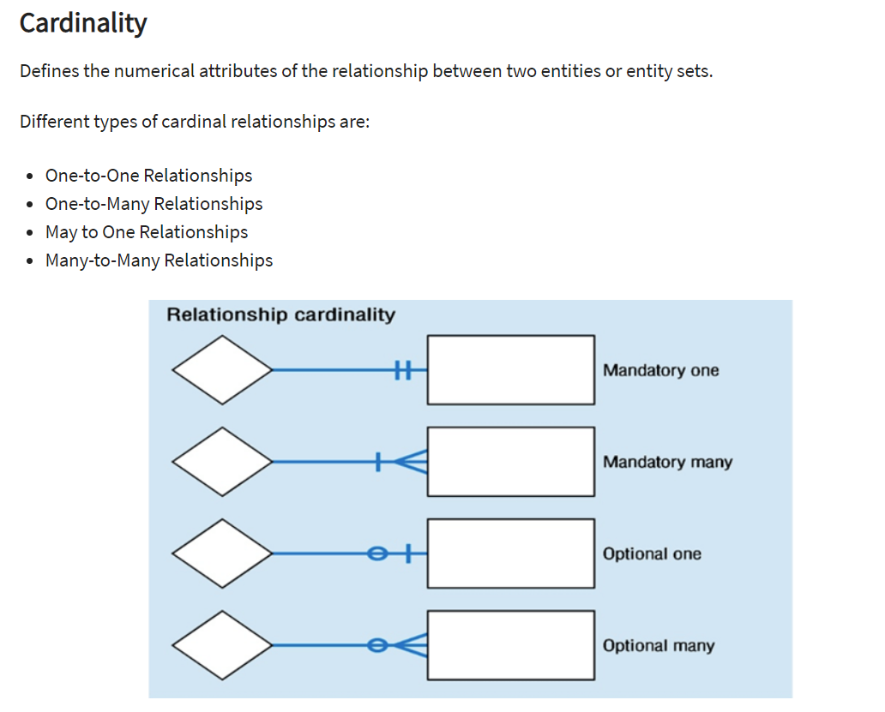

# Week 09-SQL 
## Objectives
* Create a localhost connection to a PostgreSQL server and have successfully connect to it.
* Create, use, and populate a SQL database with data.
* Create, populate, and select data from a SQL table.
* Import large CSV datasets into pgAdmin.
* Use pgAdmin to select specific rows/columns of data out from a table.
* Understand the different kinds of joins and how to use them to create new tables in pgAdmin.
* Solidify the foundations of writing basic- to intermediate-level SQL statements.
* Develop an introductory understanding of table design and database management.

### What's the relevance of PostgreSQL?
PostgreSQL, or Postgres, is a really cool free, open-source object-relational database management system. Databases are going to be crucial in our work as data professionals! PostgreSQL is also most popular with some of the careers that our course is helping prepare you for.

Remember how we discussed the relationship between client and server earlier? We can think of our database as the third part of that relationship. Essentially, the client sends a request to the server, the server grabs the associated data from the database, and then the retrieved data is returned to the client by the server.

### But what does SQL mean?
SQL stands for Structured Query Language. Put simply, SQL is the language that we use to interact with our database. SQL is the most widely used database language, is incredibly effective at manipulating data, and is one of the easier languages to learn! Learning SQL is also great for employability - There are thousands of jobs that look for candidates with SQL experience!


### **Additional Resources**  
* [PostgreSQL Documentation](https://www.postgresql.org/docs/manuals/)

* [pgAdmin Documentation](https://www.pgadmin.org/docs/)

* [PostgreSQL Tutorial](https://www.tutorialspoint.com/postgresql/)

* [SQL Order of Operation](https://sqlbolt.com/lesson/select_queries_order_of_execution) #fundemental in order to understand how sql query executes

* [SQL JOINS](https://www.tutorialspoint.com/postgresql/postgresql_using_joins.htm)

* [SQL OFFSET & FETCH](https://www.dofactory.com/sql/order-by-offset-fetch)

* [QuickDBD](https://app.quickdatabasediagrams.com/#/) # help visualize Schema

* [Subqueries In Select Statement](https://www.essentialsql.com/get-ready-to-learn-sql-server-20-using-subqueries-in-the-select-statement/)

* [Window Functions PostgreSQL](http://www.postgresqltutorial.com/postgresql-window-function/)

* [ER Diagram Tutorial](https://www.guru99.com/er-diagram-tutorial-dbms.html) #Lesson 3 Activity 7

* [SQL Tutorial for Data Analysis](https://mode.com/sql-tutorial/introduction-to-sql)

* [SQL Practice Aggregations](https://www.w3resource.com/sql-exercises/sql-aggregate-functions.php)

* [Where to Learn SQL](https://brohrer.github.io/sql_resources.html) 

* [Query Answers with SQL Server Volume I](https://read.amazon.com/kp/embed?asin=B07DVT4JHX&preview=newtab&linkCode=kpe&ref_=cm_sw_r_kb_dp_pN9MDb9YMEZ7Z) # books I own

* [Query Answers with SQL Server Volume II](https://read.amazon.com/kp/embed?asin=B07DVVGFL7&preview=newtab&linkCode=kpe&ref_=cm_sw_r_kb_dp_tN9MDbZFAPY85) # books I own

* [Build APP using SQL Server](https://www.microsoft.com/en-us/sql-server/developer-get-started)

* [The Complete Guide of SQL For Data Scientists](https://towardsdatascience.com/the-complete-guide-of-sql-for-data-scientists-902aaced94e4) # Good Read

* [ACID Explained](https://www.clustrix.com/bettersql/acid-compliance-means-care/)

* [DBMS Explained](https://www.tutorialspoint.com/dbms/index.htm)

* [Microsoft SQL Server Samples](https://github.com/microsoft/sql-server-samples)


## Lesson 1: Introduction to SQL
* Install and run Postgres and pgAdmin on their computers.
* Create a database and tables using pgAdmin.
* Define SQL data types, primary keys, and unique values.
* Load CSV files into a database and query the data.
* Articulate the four basic functions of persistent storage (CRUD) and apply this set of functions to a database.
* Combine data from multiple tables using JOINs.


* 01-Evr_Creating_a_Database  
    * Basic creation of Database using query tool
    
* 02-Ins_Creating_Tables  
    * Manually create tables and assign dtypes using `Query Tool`
    
* 03-Stu_Creating_Tables 
    * Practice creating table
    
* 04-Ins_Values_of_Uniques  
    * `Primary Key` uniquely identifies a row.
    * `SERIAL` generates a new value for each inserted record in the table. By default, the starting value is 1, and it will increase by 1 for each new record. When using `SERIAL` with our unique `PRIMARY KEY`, we automatically get unique, incrementing values for each table row
    * To update table:
    
    ```sql
    --  table to update
    UPDATE people
    -- what to set values to
    SET has_pet = true, pet_name = 'Rocket', pet_age = 8
    -- identify id where update to be made IMPORTANT!
    WHERE id = 6;
    
    -- Deleting records from Table
    DELETE FROM people
    -- IMPORTANT make sure to define condition on information to delete!
    WHERE id = 3;
    
    -- when using * in select statement return all fields from the table
    SELECT *
    FROM people;
    ```
* 05-Stu_Making_IDs  
    * Create a new column using `ALTER TABLE` and `ADD COLUMN`
    
* 06-Ins_Importing_Data  **--BASIC HOMEWORK--**
    * Using pdAdmin to import csv file.
    
* 07-Stu_Hide_and_Seek  

* 08-Stu_CRUD  
    * Created data in a table with the `INSERT` statement.
    * Read data with the use of `SELECT`.
    * Updated a table's data using `UPDATE`.
    * Delete table using `DELETE FROM `
* 09-Ins_Joins  **--BASIC HOMEWORK--**
    * 5 Primary Joins
        1. INNER JOIN returns records that have matching values in both tables.
        2. LEFT JOIN returns all records from the left table and the matched records from the right table.
        3. RIGHT JOIN returns all records from the right table and the matched records from the left table.
        4. CROSS JOIN returns records that match every row of the left table with every row of the right table. This type of join has the potential to make very large tables.
        5. FULL OUTER JOIN places null values within the columns that do not match between the two tables, after an inner join is performed.
        
* 10-Stu_Joins  


## Lesson 2: Advanced SQL Queries
* Create aggregate queries.
* Create subqueries to explore data further.
* Create views and run subqueries off of them.


* 01-Evr_Import_Data  
    
    ```sql
    -- If table already exists and you want to drop use
    DROP TABLE IF EXISTS tablename;
    
    -- When creating table it is good to right in logic that shows when a record is update
    last_update timestamp without time zone DEFAULT now() NOT NULL
    ```
    * using sakila databse create db and tables this will be needed for remainder of activities.
    
* 02-Ins_Aggregates  **--BASIC HOMEWORK--**
    * Aggregate functions calculate and retrieve data, but they do not *alter* the data, nor modify the database
    * Aggregrate functions allow calculations on a set of values and return a singular value
        * `AVG`, `MIN`, `MAX`, `SUM`, `COUNT` are just a few of the aggregrate functions we can call in SQL
        * Aggregates are typically combined with `SELECT`, `GROUP BY`, `HAVING`
    * When using an aggregate function can aliase the returned column for clearer description.
    
    ```sql
    -- to alias a column name use AS.  Whihh will create a new name for the column
    SELECT COUNT(film_id) AS "Total Films"
    FROM film;
    ```
    
    * `GROUP BY` method will first group the column indicated and then aggregates are used to get values for any columns not included in `GROUP BY`
    
* 03-Stu_GregariousAggregates  
* 04-Ins_Order_By  **--BASIC HOMEWORK--**
    * `ORDER BY` will allow you to return data set in Ascending/Descending based on values passed to method.  By default sort results will be in ascending values
    * `ROUND(<value>, <number of decimal places>)`, which rounds the value down to the specified number of decimal places.
    * `LIMIT` allows you to return a subset of the query returned
    
* 05-Stu_Order_By  
* 06-Ins_Subqueries 
    * `Subquery` is nested inside a larger query.  
    * If query cannot be accomplished using a join an alternative way to return what looking for 
    
    ```sql
    -- this is the outer query
    SELECT *
    FROM inventory
    WHERE film_id IN
    -- this is the inner query
    (
      SELECT film_id
      FROM film
      WHERE title = 'EARLY HOME'
    );
    ```
    * A helpful way to think about this is that the inner query is creating a one-time temporary table, and the outer query is selecting from that temporary table.
    * The next (outer) query is now querying from the results of the inner query.
    * Sub queries are not limited to `WHERE` statement but can be used in `SELECT` statement and `JOINS`.  Becareful when using subqueries in `SELECT` and `WHERE` statements because they can slow your query down dramatically.
    * An alternative to writing subquery in `SELECT` statement is `window_function()` **very useful** see additional resources above for more info.
    
* 07-Stu_Subqueries  
* 08-Ins_Create_Views  **--GOOD WHEN CREATING DATA SETS FOR OTHERS TO ACCESS--**
    * When there are a lot of analyst reviewing data a `VIEW` can be set up to have people access a single source of truth
    * `VIEW` is a virtual table that can be created from a single table, multiple tables, or another view (another view is frowned upon though).
    
    ```sql
    -- to create view you would use followed by query want to populate view
    CREATE VIEW name_view AS
    SELECT s.store_id, SUM(amount) AS Gross
    FROM payment AS p
    JOIN rental AS r
    ON (p.rental_id = r.rental_id)
      JOIN inventory AS i
      ON (i.inventory_id = r.inventory_id)
        JOIN store AS s
        ON (s.store_id = i.store_id)
        GROUP BY s.store_id;
        
    -- to delete view run
    DROP VIEW name_view;
    ```
    
* 09-Stu_View_Room_Queries  
* 10-Ins_Revist_Subquery  
    * Using `Entity Relationship Diagram (ERD)` to identify tables needed for a query.  
        * ERD shows connections between the tables.
        * Schema makes it easier to identify tables we need as well as the keys we will use to link our subqueries
        * See ER Diagram Tutorial in additional resources!
        
* 11-Stu_Mine_the_Subquery  


## Lesson 3: Data Modeling
* Apply data modeling techniques to database design.
* Normalize data.
* Identify data relationships.
* Create visual representations of a database through entity relationship diagrams.


* 01-Ins_Data_Normalization  
    * Data normalization eliminates data redundancy and inconsistencies.
    * 3 main forms of normalization
        * `First Normal Form (1NF)` each row contains a single value and each row is unique. Think a family's children are listed in one row.
        * `Second Normal Form (2NF)` data is in 1NH.  All non-key columns dependent on primary key for the table.  Here there are two tables.  *Family* table would contain a primary key (unique) parent_id and *Child* table has primary key (unique) of child_id. 
            * On the *Child* table we can add a family_id which is related to the parent_id on the *Family* table and can be a non-unique value.  This is known as *Transitive dependency* where a column value's reliance on another column through a third column. The transitive property states that if X > Y and Y > Z, then we can infer that X > Z. 
        * `Third normal form (3NF)`, has the data normalized to second form and contains non-transitively-dependent columns.
            * 3NF is a normal form that is used in normalizing a database design to reduce the duplication of data and ensure referential integrity by ensuring that: The entity is in second normal form.
            
* 02-Stu_Data_Normalization  
* 03-Ins_Foreign_Keys  
    * `Foreign Keys` are links between tables.  The foriegn key in first table is linked to primary key of second table
        * Foreign keys allow tables to be consistent and avoid issues caused by inserting, deleting, or updating one table without making those same changes in the other tables.
        * Foriegn keys help prevent invalid data from being entered into a column. The data *MUST* be a value from the referenced column
        * SQL wil throw an error if an attempt is made to change an `id` in one table but not the other
        * Make sure to name foreign keys appropriatly in order to clarify what referring to.
        
* 04-Stu_Foreign_Keys  
* 05-Ins_Data_Relationships  
    * `one to one relationship` each item in a column is linked to only one item from another column
    * `one to many relationship` the data from one table can be repeated for items in another table.
    * `many to many relationship` require a separate table, called a junction table, to show the relationships.
        * Junction tables use foreign keys to reference the keys in the original tables.
        * For a junction tables primary key it will be actually a *composite key* made up of not a single row unique identifier but a compination of two columns.
        
* 06-Stu_Data_Relationships  
* 07-Ins_ERD  
    * `Entity Relationship Diagram (ERD)` is a visual representation of entity relationships within a database.
    * `ERD` defines entities, their attributes, and data types, as well as illustrates the overall design of database
        * In a database 
            * The `table` is the `entity`
            * The `data` contained in the `table` are `attributes`
            * The `data type` specified defines what type the `attribute` is (Booleans, Intergers, Floats, etc)
    * 3 Types of ERD's:
        1. The first step of designing ERD is `Conceptual` Conceptual ERD models information gathered from business requirements. Entities and relationships modeled in such ERD are defined around the business's need. The need of satisfying the database design is not considered yet. Conceptual ERD is the simplest model among all.
            * A conceptual diagram has only basic information, such as the names of the tables and their attributes
        2. `Logical` Logical ERD also models information gathered from business requirements. It is more complex than conceptual model in that column types are set.
            * Note that in addition to adding the data types for each column, an ID column has been included and designated as a primary key with the PK acronym.
            * Data types are defined and primary keys are established by adding ID rows to the tables
        3. `Physical` represents the actual design blueprint of a relational database. It represents how data should be structured and related in a specific DBMS. 
            * IDs are added because when designing a physical model, the physical relationships between entities are constructed and linked. 
            * Transitioning a logical ERD to a physical ERD involves adding appropriate entities to tables and mapping their relationships.
            
* 08-Par_Designing_ERD  
* 09-Par_ERD  
* 10-Ins_Unions  
    * When we are using `JOIN` we are bringing in columns from seperate tables.  When using a `UNION` we are vertically stacking tables.
    * `UNION` by default excludes duplicate entries from the result
    * `UNION ALL` will allow duplicate entries to be displayed.  
* 11-Stu_Unions  


# SQL Homework - Employee Database: A Mystery in Two Parts


## Background

It is a beautiful spring day, and it is two weeks since you have been hired as a new data engineer at Pewlett Hackard. Your first major task is a research project on employees of the corporation from the 1980s and 1990s. All that remain of the database of employees from that period are six CSV files.

In this assignment, you will design the tables to hold data in the CSVs, import the CSVs into a SQL database, and answer questions about the data. In other words, you will perform:

1. Data Modeling

2. Data Engineering

3. Data Analysis

### Before You Begin

1. Create a new repository for this project called `sql-challenge`. **Do not add this homework to an existing repository**.

2. Clone the new repository to your computer.

3. Inside your local git repository, create a directory for the SQL challenge. Use a folder name to correspond to the challenge: **EmployeeSQL**.

4. Add your files to this folder.

5. Push the above changes to GitHub.

## Instructions

#### Data Modeling

Inspect the CSVs and sketch out an ERD of the tables. Feel free to use a tool like [http://www.quickdatabasediagrams.com](http://www.quickdatabasediagrams.com).

#### Data Engineering

* Use the information you have to create a table schema for each of the six CSV files. Remember to specify data types, primary keys, foreign keys, and other constraints.

* Import each CSV file into the corresponding SQL table.

#### Data Analysis

Once you have a complete database, do the following:

1. List the following details of each employee: employee number, last name, first name, gender, and salary.

2. List employees who were hired in 1986.

3. List the manager of each department with the following information: department number, department name, the manager's employee number, last name, first name, and start and end employment dates.

4. List the department of each employee with the following information: employee number, last name, first name, and department name.

5. List all employees whose first name is "Hercules" and last names begin with "B."

6. List all employees in the Sales department, including their employee number, last name, first name, and department name.

7. List all employees in the Sales and Development departments, including their employee number, last name, first name, and department name.

8. In descending order, list the frequency count of employee last names, i.e., how many employees share each last name.

## Bonus (Optional)

As you examine the data, you are overcome with a creeping suspicion that the dataset is fake. You surmise that your boss handed you spurious data in order to test the data engineering skills of a new employee. To confirm your hunch, you decide to take the following steps to generate a visualization of the data, with which you will confront your boss:

1. Import the SQL database into Pandas. (Yes, you could read the CSVs directly in Pandas, but you are, after all, trying to prove your technical mettle.) This step may require some research. Feel free to use the code below to get started. Be sure to make any necessary modifications for your username, password, host, port, and database name:

   ```sql
   from sqlalchemy import create_engine
   engine = create_engine('postgresql://localhost:5432/<your_db_name>')
   connection = engine.connect()
   ```

* Consult [SQLAlchemy documentation](https://docs.sqlalchemy.org/en/latest/core/engines.html#postgresql) for more information.

* If using a password, do not upload your password to your GitHub repository. See [https://www.youtube.com/watch?v=2uaTPmNvH0I](https://www.youtube.com/watch?v=2uaTPmNvH0I) and [https://martin-thoma.com/configuration-files-in-python/](https://martin-thoma.com/configuration-files-in-python/) for more information.

2. Create a histogram to visualize the most common salary ranges for employees.

3. Create a bar chart of average salary by title.

## Epilogue

Evidence in hand, you march into your boss's office and present the visualization. With a sly grin, your boss thanks you for your work. On your way out of the office, you hear the words, "Search your ID number." You look down at your badge to see that your employee ID number is 499942.

## Submission

* Create an image file of your ERD.

* Create a `.sql` file of your table schemata.

* Create a `.sql` file of your queries.

* (Optional) Create a Jupyter Notebook of the bonus analysis.

* Create and upload a repository with the above files to GitHub and post a link on BootCamp Spot.

### Copyright

Trilogy Education Services © 2019. All Rights Reserved.
